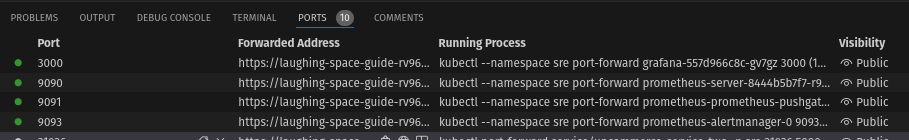
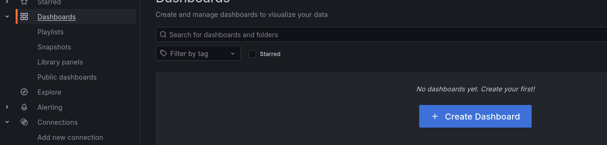
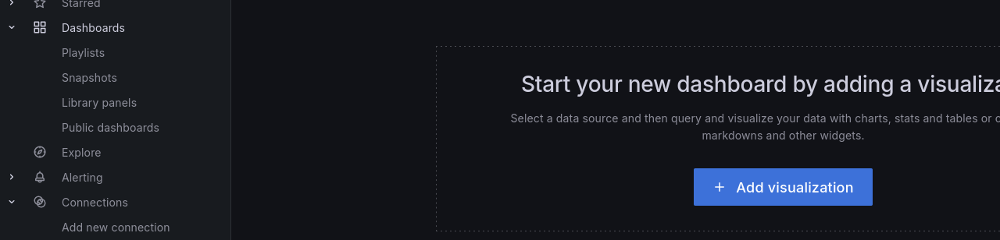
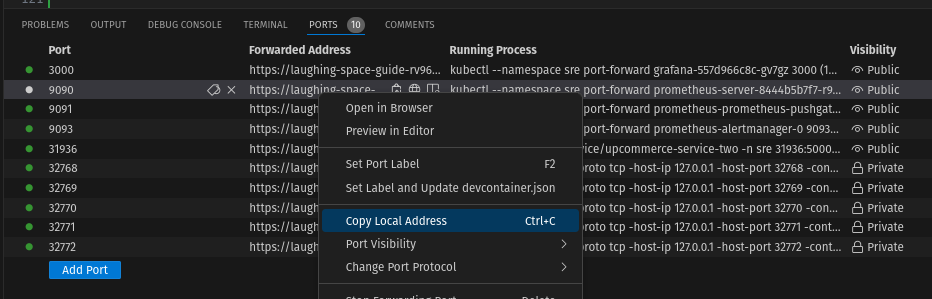
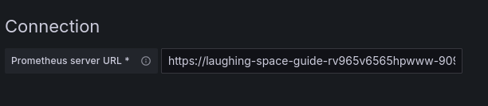
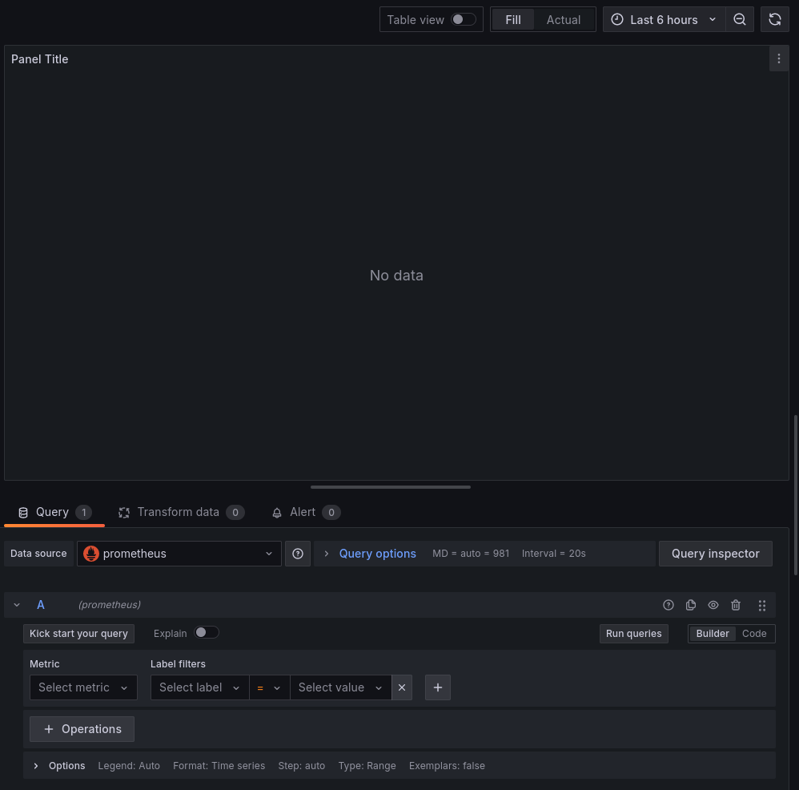
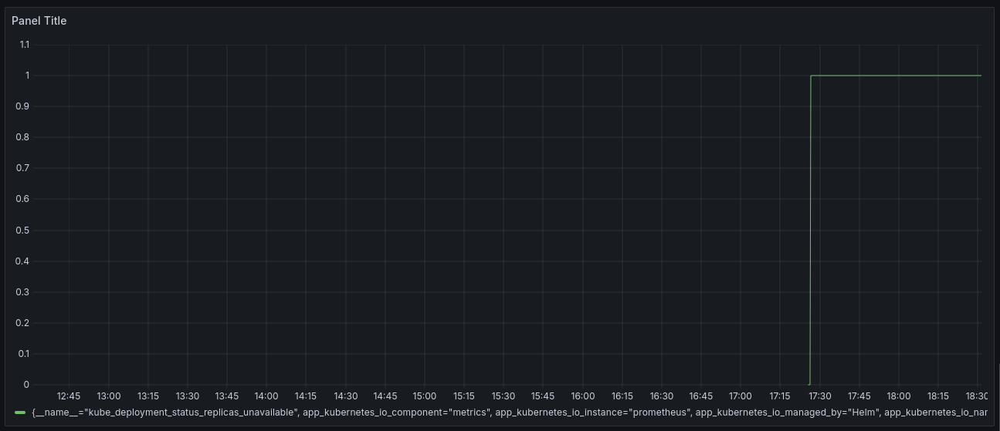
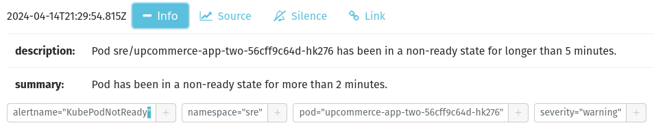

# SRE: Troubleshooting deployment issues and reporting incidents

## Setup

1. Setup kube

```sh
minikube start
```

2. Create namespace

```sh
kubectl create namespace sre
```

3. Install prometheus

```sh
helm repo add prometheus-community https://prometheus-community.github.io/helm-charts
helm repo update
helm install prometheus prometheus-community/prometheus -f prometheus.yml --namespace sre
```

4. Install grafana

```sh
helm repo add grafana https://grafana.github.io/helm-charts
helm repo update
helm install grafana grafana/grafana --set adminPassword="admin" --namespace sre
```

5. Create a deployment and service

```sh
kubectl apply -f deployment.yml -n sre
kubectl apply -f service.yml -n sre
```

6. Port Forward

- Prometheus server

```sh
export POD_NAME=$(kubectl get pods --namespace sre -l "app.kubernetes.io/name=prometheus,app.kubernetes.io/instance=prometheus" -o jsonpath="{.items[0].metadata.name}")

kubectl --namespace sre port-forward $POD_NAME 9090
```

- Prometheus Alertmanager

```sh
export POD_NAME=$(kubectl get pods --namespace sre -l "app.kubernetes.io/name=alertmanager,app.kubernetes.io/instance=prometheus" -o jsonpath="{.items[0].metadata.name}")

kubectl --namespace sre port-forward $POD_NAME 9093
```

- Prometheus PushGateway

```sh
export POD_NAME=$(kubectl get pods --namespace sre -l "app.kubernetes.io/instance=prometheus,app.kubernetes.io/name=prometheus-pushgateway" -o jsonpath="{.items[0].metadata.name}")

kubectl --namespace sre port-forward $POD_NAME 9091

```

- Grafana server

```sh
export POD_NAME=$(kubectl get pods --namespace sre -l "app.kubernetes.io/name=grafana,app.kubernetes.io/instance=grafana" -o jsonpath="{.items[0].metadata.name}")

kubectl --namespace sre port-forward $POD_NAME 3000
```

- Application

_This may not work. It's expected_

```sh
minikube service upcommerce-service-two -n sre --url

kubectl port-forward service/upcommerce-service-two -n sre 31936:5000
```

7. Check status

```sh
kubectl get deployment -n sre
```

The output:

```sh
NAME                                READY   UP-TO-DATE   AVAILABLE   AGE
grafana                             1/1     1            1           73m
prometheus-kube-state-metrics       1/1     1            1           74m
prometheus-prometheus-pushgateway   1/1     1            1           74m
prometheus-server                   1/1     1            1           74m
upcommerce-app-two                  0/1     1            0           64m
```

## Access Grafana

1. In the terminal window make sure port for grafana (3000) is public



2. Open the link and login (admin/admin)

3. In grafana go to Dashboards -> Create Dashboard -> Add visualization -> Configure new datasource






4. Select prometheus, in the connection field enter URL for prometheus:





5. Press Save and Test

6. Repeat step 3. but at the end select new created datasource



7. Here you can add and test various metrics and save to Dashboard


## Troubleshooting using kubectl

1. get deployments status

```sh
kubectl get deployment -n sre
```

outpouts

```
NAME                                READY   UP-TO-DATE   AVAILABLE   AGE
grafana                             1/1     1            1           27h
prometheus-kube-state-metrics       1/1     1            1           27h
prometheus-prometheus-pushgateway   1/1     1            1           27h
prometheus-server                   1/1     1            1           27h
upcommerce-app-two                  0/1     1            0           29s
```

2. get detailed info of the deployment

```sh
kubectl describe deployment upcommerce-app-two -n sre
```

outputs:

```
Name:                   upcommerce-app-two
Namespace:              sre
CreationTimestamp:      Sun, 14 Apr 2024 21:26:48 +0000
Labels:                 <none>
Annotations:            deployment.kubernetes.io/revision: 1
Selector:               app=upcommerce-app-two
Replicas:               1 desired | 1 updated | 1 total | 0 available | 1 unavailable
StrategyType:           RollingUpdate
MinReadySeconds:        0
RollingUpdateStrategy:  25% max unavailable, 25% max surge
Pod Template:
  Labels:  app=upcommerce-app-two
  Containers:
   upcommerce:
    Image:      uonyeka/upcommerce:v3
    Port:       5000/TCP
    Host Port:  0/TCP
    Limits:
      cpu:        10
      memory:     4Gi
    Environment:  <none>
    Mounts:       <none>
  Volumes:        <none>
Conditions:
  Type           Status  Reason
  ----           ------  ------
  Available      False   MinimumReplicasUnavailable
  Progressing    True    ReplicaSetUpdated
OldReplicaSets:  <none>
NewReplicaSet:   upcommerce-app-two-56cff9c64d (1/1 replicas created)
Events:
  Type    Reason             Age    From                   Message
  ----    ------             ----   ----                   -------
  Normal  ScalingReplicaSet  2m23s  deployment-controller  Scaled up replica set upcommerce-app-two-56cff9c64d to 1
```

**_which already indicates the problem (MinimumReplicasUnavailable) but we will continue_**

3. get detailed info about the pod:

```sh
kubectl get pods -n sre
```

outputs:

```
AME                                                READY   STATUS    RESTARTS      AGE
grafana-557d966c8c-gv7gz                            1/1     Running   2 (14m ago)   27h
prometheus-alertmanager-0                           1/1     Running   2 (14m ago)   27h
prometheus-kube-state-metrics-65468947fb-nksfb      1/1     Running   4 (13m ago)   27h
prometheus-prometheus-node-exporter-vldvb           1/1     Running   2 (14m ago)   27h
prometheus-prometheus-pushgateway-76976dc66-b7bdx   1/1     Running   2 (14m ago)   27h
prometheus-server-8444b5b7f7-r977w                  2/2     Running   4 (14m ago)   27h
upcommerce-app-two-56cff9c64d-hk276                 0/1     Pending   0             10m
```

```sh
kubectl describe pod upcommerce-app-two-56cff9c64d-hk276 -n sre
```

outputs

```
Name:             upcommerce-app-two-56cff9c64d-hk276
Namespace:        sre
Priority:         0
Service Account:  default
Node:             <none>
Labels:           app=upcommerce-app-two
                  pod-template-hash=56cff9c64d
Annotations:      <none>
Status:           Pending
IP:               
IPs:              <none>
Controlled By:    ReplicaSet/upcommerce-app-two-56cff9c64d
Containers:
  upcommerce:
    Image:      uonyeka/upcommerce:v3
    Port:       5000/TCP
    Host Port:  0/TCP
    Limits:
      cpu:     10
      memory:  4Gi
    Requests:
      cpu:        10
      memory:     4Gi
    Environment:  <none>
    Mounts:
      /var/run/secrets/kubernetes.io/serviceaccount from kube-api-access-rhk94 (ro)
Conditions:
  Type           Status
  PodScheduled   False 
Volumes:
  kube-api-access-rhk94:
    Type:                    Projected (a volume that contains injected data from multiple sources)
    TokenExpirationSeconds:  3607
    ConfigMapName:           kube-root-ca.crt
    ConfigMapOptional:       <nil>
    DownwardAPI:             true
QoS Class:                   Guaranteed
Node-Selectors:              <none>
Tolerations:                 node.kubernetes.io/not-ready:NoExecute op=Exists for 300s
                             node.kubernetes.io/unreachable:NoExecute op=Exists for 300s
Events:
  Type     Reason            Age    From               Message
  ----     ------            ----   ----               -------
  Warning  FailedScheduling  9m41s  default-scheduler  0/1 nodes are available: 1 Insufficient cpu. preemption: 0/1 nodes are available: 1 No preemption victims found for incoming pod..
  Warning  FailedScheduling  4m33s  default-scheduler  0/1 nodes are available: 1 Insufficient cpu. preemption: 0/1 nodes are available: 1 No preemption victims found for incoming pod..
```

**_Which also indicates the problem (Insufficient cpu)_**

4. Get logs from the pod:

```sh
kubectl get pods -n sre
```

```sh
kubectl logs upcommerce-app-two-56cff9c64d-hk276 -n sre
```

_(No logs if pod is not started)_

5. Fix the problem:

in deployment.yml, modify the 

```yml
containers:
    - name: upcommerce
        ...
        resources:
        limits:
            cpu: "10"
```

limits to "1" (Codespaces doesn't provide more than 1 CPU)

apply new settings:

```sh
kubectl apply -f deployment.yml -n sre
```

## Troubleshooting using Grafana/Prometheus


1. Usefull metrics to be added to grafana:

```
kube_deployment_status_replicas_unavailable{deployment="upcommerce-app-two", namespace="sre"}
```

Show unavailable replicas:



2. Prometheus alert manager

Prometheus alert manager contains an alert signaling of unavailable replica:


